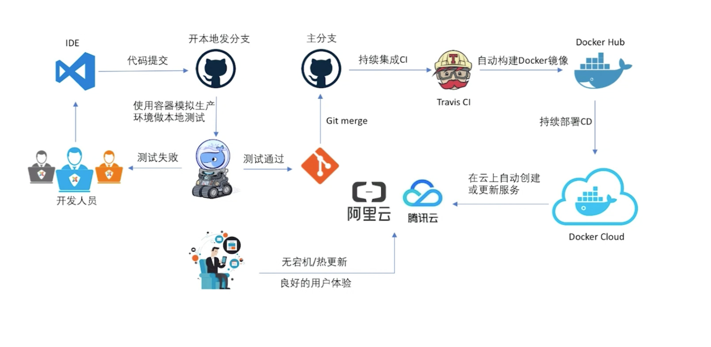

# gitlab+gitlab-ci+docker+dnsmasq 本地集成环境搭建

## 总览




## 添加centos7 box

centos7.box可以先去`https://app.vagrantup.com/geerlingguy/boxes/centos7`下载

```
vagrant add box geerlingguy/centos7 centos7.box
```

## git本地服务器选型

具体可以去[https://github.com/topics/git](https://github.com/topics/git) 查看git相关话题

- [gitlab](https://about.gitlab.com/)
- [gogs](https://gogs.io/)
- [gitea](https://gitea.io/zh-cn/)
- [gitbucket](https://gitbucket.github.io/)

## CI/CD工具

- [Jenkins](https://jenkins.io/)
- [GitLab CI](https://about.gitlab.com/features/gitlab-ci-cd/)

具体可以去[https://github.com/topics/continuous-integration](https://github.com/topics/continuous-integration) 查看持续集成相关话题


## 添加三台centos7的虚拟机

- 1台安装gitlab
- 1台安装gitlab-ci+docker
- 1台安装dnsmasq

vagrant默认root密码是vagrant

Vagrantfile:

```
boxes = [
    {
        :name => "gitlab",
        :eth1 => "192.168.211.10",
        :mem => "4096",
        :cpu => "2"
    },
    {
        :name => "gitlab-ci",
        :eth1 => "192.168.211.11",
        :mem => "1024",
        :cpu => "1"
    },
    {
        :name => "dnsserver",
        :eth1 => "192.168.211.12",
        :mem => "1024",
        :cpu => "1"
    }  
]

Vagrant.configure("2") do |config|

  config.vm.box = "geerlingguy/centos7"

  boxes.each do |opts|
    config.vm.define opts[:name] do |config|
      config.vm.hostname = opts[:name]
      config.vm.provider "vmware_fusion" do |v|
        v.vmx["memsize"] = opts[:mem]
        v.vmx["numvcpus"] = opts[:cpu]
      end

      config.vm.provider "virtualbox" do |v|
        v.customize ["modifyvm", :id, "--memory", opts[:mem]]
        v.customize ["modifyvm", :id, "--cpus", opts[:cpu]]
      end

      config.vm.network :private_network, ip: opts[:eth1]
    end
end

config.vm.synced_folder "./labs", "/home/vagrant/labs"
config.vm.provision "shell", privileged: true, path: "./setup.sh"

end

```

## 修改两台机器的hosts文件(后面不需要 因为有dns服务器了)

```
192.168.211.10 gitlab.example.com
```

## 两台centos7修改默认yum源为阿里云的源

见lab/scripts/setup.sh

```
#/bin/sh

# 更新源为阿里云源
sudo mv /etc/yum.repos.d/CentOS-Base.repo /etc/yum.repos.d/CentOS-Base.repo.backup
sudo echo '[base]
name=CentOS-$releasever - Base
#mirrorlist=http://mirrorlist.centos.org/?release=$releasever&arch=$basearch&repo=os
baseurl=https://mirrors.aliyun.com/centos/$releasever/os/$basearch/
gpgcheck=1
gpgkey=file:///etc/pki/rpm-gpg/RPM-GPG-KEY-CentOS-7

#released updates
[updates]
name=CentOS-$releasever - Updates
# mirrorlist=http://mirrorlist.centos.org/?release=$releasever&arch=$basearch&repo=updates
baseurl=https://mirrors.aliyun.com/centos/$releasever/updates/$basearch/
gpgcheck=1
gpgkey=file:///etc/pki/rpm-gpg/RPM-GPG-KEY-CentOS-7

#additional packages that may be useful
[extras]
name=CentOS-$releasever - Extras
# mirrorlist=http://mirrorlist.centos.org/?release=$releasever&arch=$basearch&repo=extras
baseurl=https://mirrors.aliyun.com/centos/$releasever/extras/$basearch/
gpgcheck=1
gpgkey=file:///etc/pki/rpm-gpg/RPM-GPG-KEY-CentOS-7

#additional packages that extend functionality of existing packages
[centosplus]
name=CentOS-$releasever - Plus
# mirrorlist=http://mirrorlist.centos.org/?release=$releasever&arch=$basearch&repo=centosplus
baseurl=https://mirrors.aliyun.com/centos/$releasever/centosplus/$basearch/
gpgcheck=1
enabled=0
gpgkey=file:///etc/pki/rpm-gpg/RPM-GPG-KEY-CentOS-7' > /etc/yum.repos.d/CentOS-Base.repo
sudo yum makecache

sudo rpm --import https://mirrors.aliyun.com/docker-ce/linux/centos/gpg

sudo yum install -y git vim gcc glibc-static telnet
```

## 为第一台服务器添加安装gitlab的脚本

见lab/scripts/gitlab.sh

## 为第二台服务器添加安装docker的脚本

docker安装教程:[https://docs.docker.com/install/linux/docker-ce/centos/](https://docs.docker.com/install/linux/docker-ce/centos/)

见lab/scripts/docker.sh


## 为第二台服务器添加安装gitlab-ci的脚本

见lab/scripts/gitlab-ci.sh